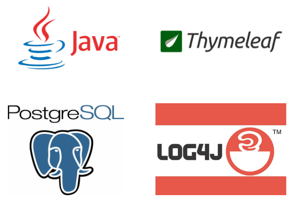

# Codecool shop

## Introduction

The Codecool shop was two sprints teamwork project in the java-based OOP module of our full-stack programmer course.
The main aim was to learn and experience that how can different technologies cooperate and fit together.
The project includes some basic unit tests linked to the cart activities of the user. 

## Technologies

The project use java servlets and PostgreSQL for implementing back-end tasks, and thymeleaf, HTML, CSS for front-end.
Log4j technology - with property file - apply to log out the main user activities and their consequences.
Mockito applied for unit testing of the cart operating.

## Project status

Even though, due to the short time, not all features were 100% targeted, our team tried to implement as many tasks as possible.
The targeted memory-based functionalities are completed as it can be reached in the "development" branch.
The implementation of further tasks is in progress on the unmerged branches.

## Setting up database

The runnable version can be found on the development branch of the repository.

1. After cloning the project to the local machine, the next step is the creation of an SQL database within the 
   local repository:
   sudo -u <user_name> createdb <name_of_database> 

2. Initiating connection to the created database:  
   \connect <name_of_database>
   
3. Move to "sample_data/" folder and enter command into the terminal: 
   psql -U <username> <name_of_database> < init_db.sql

4. Configure your created database within your IDE
